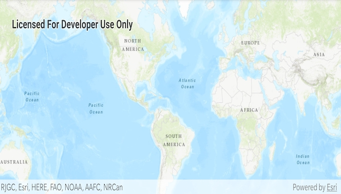

# Display a Map
The **Display Map** app is the most basic Map app for the [ArcGIS Runtime SDK for Android](https://developers.arcgis.com/en/android/).
It shows how to inflate a `MapView` in the layout XML of the activity, create a `ArcGISMap` with a static `Basemap.Type` and bind the `ArcGISMap` to the `MapView`.  By default, this map supports basic zooming and panning operations.



## Features
* ArcGISMap
* MapView
* Basemap

## Developer Pattern
Create a `ArcGISMap` with a `Basemap.Type` and an initial viewpoint. 

```java
// inflate MapView from layout
mMapView = (MapView) findViewById(R.id.mapView);
// create a map with the BasemapType topographic
ArcGISMap mMap = new ArcGISMap(Basemap.Type.TOPOGRAPHIC, 34.056295, -117.195800, 16);
// set the map to be displayed in this view
mMapView.setMap(mMap);
```
