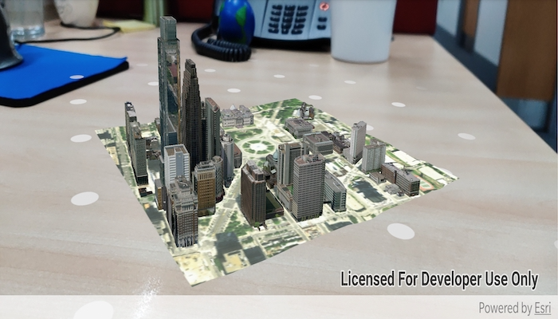

# Display scene in tabletop AR

Use augmented reality (AR) to pin a scene to a table or desk for easy exploration.

## Use case

Tabletop scenes allow you to use your device to interact with scenes as if they are 3D-printed model models sitting on your desk. You could use this to virtually explore a proposed development without needing to create a physical model.

## How to use the sample

You'll see a feed from the camera when you open the sample. Tap on any flat, horizontal surface (like a desk or table) to place the scene. With the scene placed, you can move the camera around the scene to explore. You can also pan the scene with a drag action.

NOTE: [Google Play Services for AR](https://play.google.com/store/apps/details?id=com.google.ar.core&hl) must be installed to run this app.

## How it works

1. Create an `ArcGISARView`.
2. Listen for a tap from the user, then use `mArView.setInitialTransformationMatrix(screenPoint)` to set the initial transformation, which allows you to place the scene. This method uses ARCore's built-in plane detection.
3. Create and display the scene. To allow you to look at the content from below, set the base surface navigation constraint to `NONE`.
4. To create a realistic tabletop scene experience, set the scene's base surface opacity to 0. This will ensure that only the target scene content is visible.
5. For tabletop scenes, the `arView`'s `originCamera` must be set such that the altitude of the camera matches the altitude of the lowest point in the scene. Otherwise, scene content will float above or below the targeted anchor position identified by the user. For this sample, the origin camera's latitude and longitude are set to the center of the scene for best results. This will give the impression that the scene is centered on the location the user tapped.
6. Set the `translationFactor` on the scene view such that the user can view the entire scene by moving the device around it. The translation factor defines how far the virtual camera moves when the physical camera moves.
    * A good formula for determining translation factor to use in a tabletop map experience is **translationFactor = sceneWidth * tableTopWidth**. The scene width is the width/length of the scene content you wish to display in meters. The tabletop width is the length of the area on the physical surface that you want the scene content to fill. To determine the scene's width, the sample examines all operational layers and uses the geometry engine to combine their extents and compute the overall width.

## Relevant API

* ArcGISARView
* Surface.setOpacity(...)

## Offline Data

1. Download the data from [ArcGIS Online](https://www.arcgis.com/home/item.html?id=7dd2f97bb007466ea939160d0de96a9d).
2. Open your command prompt and navigate to the folder where you extracted the contents of the data from step 1.
3. Execute the following command:
`adb push philadelphia.mspk /Android/data/com.esri.arcgisruntime.sample.displaysceneintabletopar/files/philadelphia.mspk`

Link | Local Location
---------|-------|
|[Philadelphia Mobile Scene Package ](https://www.arcgis.com/home/item.html?id=7dd2f97bb007466ea939160d0de96a9d)| /Android/data/com.esri.arcgisruntime.sample.displaysceneintabletopar/files/philadelphia.mspk |

## About the data

This sample uses the [Philadelphia Mobile Scene Package](https://www.arcgis.com/home/item.html?id=7dd2f97bb007466ea939160d0de96a9d). It was chosen because it is a compact scene ideal for tabletop use. Note that tabletop mapping experiences work best with small, focused scenes. The small, focused area with basemap tiles defines a clear boundary for the scene.

## Additional information

This sample requires a device that is compatible with ARCore 1.8 on Android.

**Tabletop AR** is one of three main patterns for working with geographic information in augmented reality. See [Augmented reality](https://developers.arcgis.com/android/latest/guide/display-scenes-in-augmented-reality.htm) in the guide for more information.

This sample uses the ArcGIS Runtime Toolkit. See [Augmented reality](https://developers.arcgis.com/android/latest/guide/display-scenes-in-augmented-reality.htm) in the guide to learn about the toolkit and how to add it to your app.

## Tags

augmented reality, drop, mixed reality, model, pin, place, table-top, tabletop
