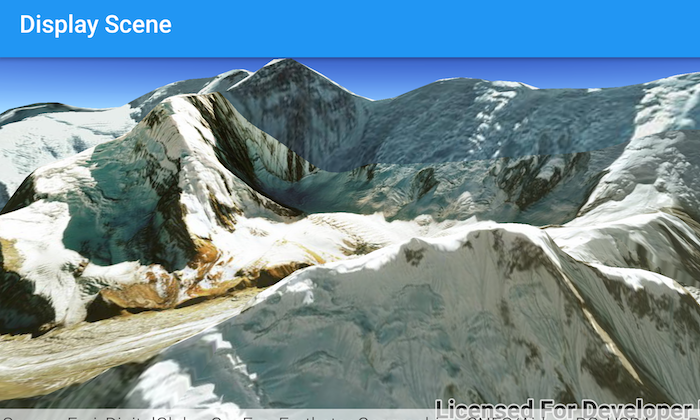

# Display a Scene
Display a scene with elevation data.

## How to use the sample
Simply run the app.

## How it works
1. Create an `ArcGISScene` and set a `Basemap`.
1. Set the `ArcGISScene` to a `SceneView`.
1. Create an `ArcGISTiledElevationSource` and add it to the `ArcGISScene` with `getBaseSurface().getElevationSources().add(...)`.
1. Create a `Camera` and set the `SceneView` viewpoint to it with `setViewpointCamera(...)`.

## Relevant API
* ArcGISScene
* ArcGISTiledElevationSource
* Camera
* SceneView

#### Tags
Maps and Scenes