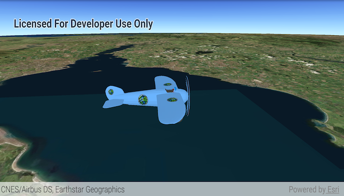

# Distance Composite Symbol
Create a graphic using a distance composite scene symbol. Distance composite scene symbols can render different symbols depending on the distance between the camera and the graphic.

## How to use the sample
Zoom in and out to see the symbol of the graphic change.

## How it works
To create and display a `DistanceCompositeSceneSymbol`:

1. Create a `GraphicsOverlay` and add it to the `SceneView`.
1. Create symbols for each `Range` of the composite symbol.
1. Create a `DistanceCompositeSceneSymbol`.
1. Add a range for each symbol to `DistanceCompositeSceneSymbol.getRangeCollection().add(new Range(symbol, min distance, max distance))`.
  * symbol to be used within the min/max range that is given
  * min and max distance that the symbol will be display at from the `Camera`
1. Create a `Graphic` with the symbol: `Graphic(Point, DistanceCompositeSceneSymbol)`
1. Add the `Graphic` to the `GraphicsOverlay`.

## Relevant API
* ArcGISScene
* ArcGISTiledElevationSource
* Camera
* DistanceCompositeSceneSymbol
* DistanceCompositeSceneSymbol.Range
* Graphic
* GraphicsOverlay
* ModelSceneSymbol 
* Range
* RangeCollection
* SceneView
* SimpleMarkerSceneSymbol

#### Tags
Visualization
