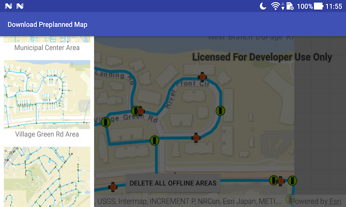

# Download Preplanned Map

This sample demonstrates how to download preplanned map areas from a webmap. In the preplanned offline workflow, the author of the online map defines map areas for offline use. When these areas are created, their offline packages are created and stored online for clients to download.

## Features

* Geodatabase
* GeodatabaseSyncTask
* DownloadPreplannedOfflineMapJob
* DownloadPreplannedOfflineMapResult;
* OfflineMapTask
* PreplannedMapArea

## How to use the sample

Once the previews of the `PreplannedMapArea`s have loaded in the Android navigation drawer on the left, click one of the previews to download the `PreplannedMapArea` to the device and display it on the `MapView`.

Use the 'Delete All Offline Areas' button to delete all `PreplannedMapArea`s from the local device.

## Developer Pattern

1. Use a `PortalItem` and `OfflineMapTask` to access information about the `PreplannedMapArea`s available.
1. On user click, download the `PreplannedMapArea` to the local device using a `DownloadPreplannedOfflineMapJob` and add the `DownloadPreplannedOfflineMapResult.getOfflineMap()` to the `MapView`.
1. Don't forget to unregister and close the `Geodatabase`
