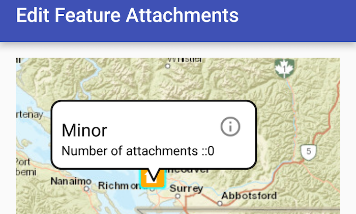

# Edit feature attachments
Add, delete or fetch attachments for a specific feature in a feature layer.

## How to use the sample
Tap a feature on the map to open a callout displaying number of attachments. Tap on the info button to view/edit the attachments. Selecting a list entry downloads the attachment and opens it in gallery to view. Tap on the floating action button '+' to add an attachment or long press to delete.

## How it works
The map view provides a way to add a listener to screen taps using the `setOnTouchListener` method. The app uses the `MotionEvent` passed in to the `onSingleTapConfirmed` method to identify features on mapview based on the tolerance. `fetchAttachmentsAsync` method on selected feature returns a `List<Attachment>` list of attachments. To download an attachment `fetchDataAsync` method returns an `InputStream` which is used to download the attachment as a drawable before it can be converted to Bitmap.

To add/delete an attachment, `addAttachmentAsync` and `deleteAttachmentAsync` methods are used. A listener is created to update the **ServiceFeatureTable** after finishing the async tasks of add/delete. The `updateFeatureAsync` updates the feature table and `applyEditsAsync` method is then called on the service table to apply the local changes on the server asynchronously.

## Relevant API
* ServiceFeatureTable
* FeatureLayer
* FetchAttachmentsAsync
* FetchDataAsync
* DeleteAttachmentAsync
* UpdateFeatureAsync
* ApplyEditsAsync

#### Tags
Edit and Manage Data