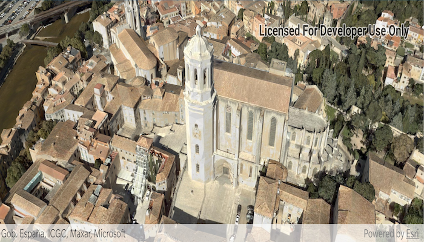

# Explore scenes in flyover AR

Use augmented reality (AR) to quickly explore a scene more naturally than you could with a touch or mouse interface.

## Use case

You can use AR to drop into an area and visualize information, like a proposed development or a historical model of a city. You could use flyover AR to explore a city by walking through it virtually.

## How to use the sample

When you open the sample, you'll be viewing the scene from above. You can walk around, using your device as a window into the scene. Try moving vertically to get closer to the ground. Touch gesture which allow you to pan and zoom around a scene work as usual.

## How it works

1. Create an `ArcGISARView`.
2. Create the scene, add content, then display it.
3. When the content you want to view loads, get its center point and use that to create the origin camera for the AR view. Note that the altitude should be set so that all scene content is visible. For a city, a good value might be a bit higher than the tallest building. The sample uses 250 meters in the absence of tall buildings in the sample data.
4. Set the translation factor so that you can move through the scene easily. With a translation factor of 1000, you will move 1000 feet in the scene for every foot you move the physical device.

## Relevant API

* ArcGISARView
* SceneView

## About the data

This sample uses a sample [integrated mesh layer](https://www.arcgis.com/home/item.html?id=dbc72b3ebb024c848d89a42fe6387a1b) provided by [Vricon](https://www.vricon.com/). The integrated mesh layer shows an area around the US-Mexico border.

The [world elevation service](https://elevation3d.arcgis.com/arcgis/rest/services/WorldElevation3D/Terrain3D/ImageServer) is used to show terrain while the integrated mesh layer loads.

## Additional information

This sample requires a device that is compatible with ARCore 1.8 on Android.

**Flyover AR** is one of three main patterns for working with geographic information in augmented reality. See the [guide doc]() for more information.

This sample uses the ArcGIS Runtime Toolkit. See [Augmented Reality](https://developers.arcgis.com/android/latest/guide/display-scenes-in-augmented-reality.htm) in the guide to learn about the toolkit and how to add it to your app.

## Tags

augmented reality, bird's eye, birds-eye-view, fly over, flyover, mixed reality, translation factor
