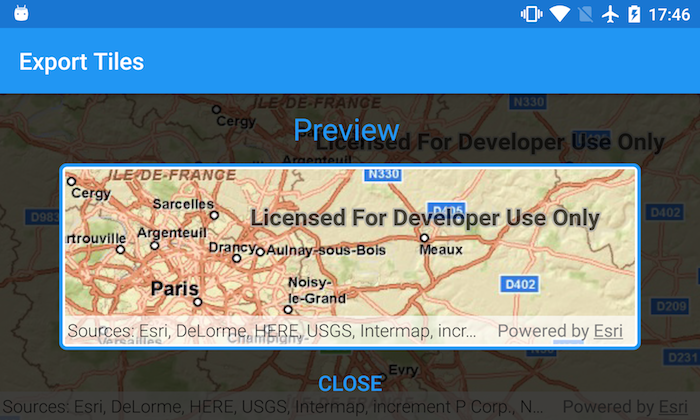

# Export tiles
### Category: Edit and Manage Data
This sample demonstrates how to export tiles from a map server.

## How to use the sample

Pan and zoom into the desired area, making sure the area is within the red block. Tap on the `Export tiles` button to start the process. On successful completion you will see a preview of the downloaded tpk.

## How it works

The sample uses the `.createDefaultExportTileCacheParametersAsync(areaOfInterest, minScale, maxScale)` method on `ExportTileCacheTask` class to generate `ExportTileCacheParameters` by providing the area of interest and the min/max scale for the tpk. 

It then uses these parameters in the `exportTileCacheJob(downloadPath)` method to generate a `Job`. The job, on successful completion, results in a `TileCache` object which is used to create an `ArcGISTiledLayer` and shown in a map as a preview.

The `TileCache` file is stored in _/sdcard/ArcGIS/Samples/TileCache_ under the name _worldStreetMap.tpk_.
