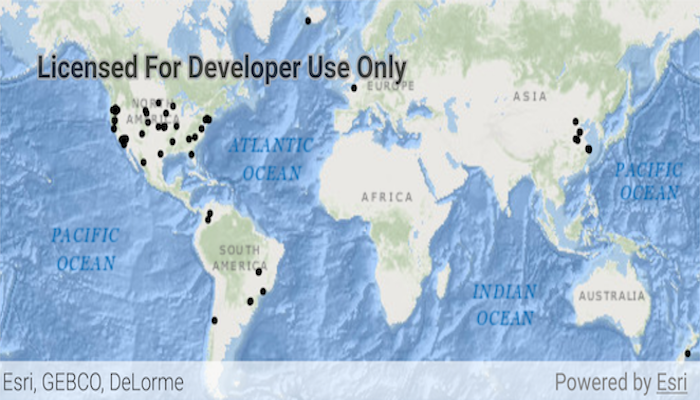

# Feature collection layer (query)

Create a feature collection layer to show a query result from a service feature table.

## Use case

Consider a national wireless telecommunications company who wants to improve connectivity within areas of poor coverage. Their cell towers, cell tower radii and state boundaries data are held within service feature tables, which can be queried for states that don't meet a certain threshold of coverage. The query result can be used to create and display a single feature collection layer for analysis of areas requiring improved coverage.

## How to use the sample

When launched, this sample displays a map with point features as a feature collection layer. Pan and zoom to explore the map.

## How it works

1. Perform a query using the `queryFeaturesAsync()` method on a `ServiceFeatureTable`.
2. Instantiate a `FeatureCollectionTable` with the result of the query.
3. Create a `FeatureCollection` and add the feature collection table to it.
4. Create a `FeatureCollectionLayer` from the feature collection.
5. Add the feature collection layer to the map's `operationalLayers` list.

## Relevant API

* FeatureCollection
* FeatureCollectionLayer
* FeatureCollectionTable
* FeatureLayer
* FeatureQueryResult
* FeatureTable
* QueryParameters
* ServiceFeatureTable

## About the data

This application utilizes data from the wildfire feature service. It loads at full extent with features indicating wildfire response point features across the world.

## Tags

layer, query, search, table
