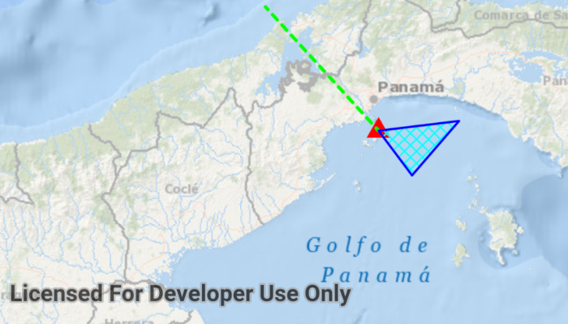

# Feature collection layer

Create a feature collection layer from a feature collection table, and add it to a map.

## Use case

A feature collection allows easily importing external data (such as CSV files), as well as creating custom schema for data that is in non-standardized format. This data can then be used to populate a feature collection table, and displayed in a feature collection layer using the attributes and geometries provided in the external data source. For example, an electricity supplier could use this functionality to visualize existing location data of coverage areas (polygons), power stations (points), transmission lines (polylines), and others.

## How to use the sample

When launched, this sample displays a feature collection layer with a point, polyline and polygon geometry. Pan and zoom to explore the scene.

## How it works

1. Create a `FeatureCollectionLayer` using a new feature collection, `FeatureCollectionLayer(featureCollection)`
2. Add the feature collection layer to the map, `ArcGISMap.getOperationalLayers().add(featureCollectionLayer)`.
3. Create a `FeatureCollectionTable` with `new FeatureCollectionTable(fields, geometryType, spatialReference)`, specifying `GeometryType.POINT`, `GeometryType.POLYLINE`, or `GeometryType.POLYGON` for geometry type.
    *  Additionally, pass in a list of `Field` objects to represent the table's schema.
4. Assign a `SimpleRenderer` to each table to render any `Feature`s from that table using the `Symbol` that was set.
5. Add the feature collection table to the feature collection, `FeatureCollection.getTables().add(featureCollectionTable)`.
6. Create a feature from the feature collection table passing an attribute and geometry for that feature with `featureCollectionTable.createFeature(attributes, geometry)`.
7. Add new features to the table, `featureCollectionTable.addFeatureAsync(feature)`.

## Relevant API

* Feature
* FeatureCollection
* FeatureCollectionLayer
* FeatureCollectionTable
* Field
* SimpleRenderer

## Tags

collection, feature, layers, table
