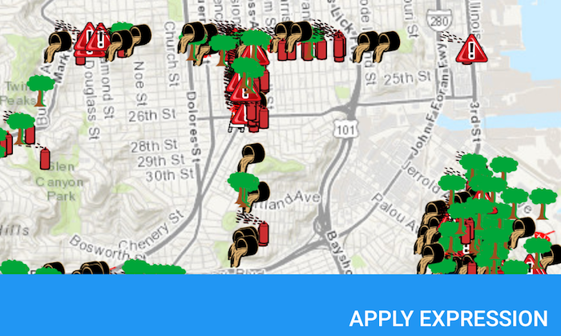

# Feature Layer Definition Expression
Limit which features to display on the map.

## How to use the sample
Use the buttons in the bottom toolbar to apply or reset definition expression.

## How it works

Set the definition expression property on a feature layer using an SQL where clause to limit which features are displayed on the map.

## Relevant API
* FeatureLayer
* ServiceFeatureTable

#### Tags
Search and Query
