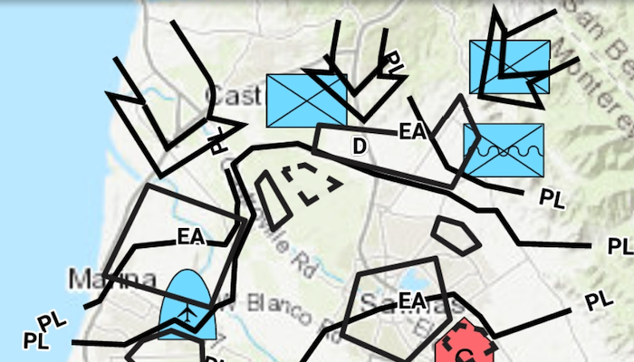

# Feature Layer Dictionary Renderer

Convert features into graphics to show them with mil2525d symbols.

## Use case

A dictionary renderer uses a style file along with a rule engine to display advanced symbology. This is useful for displaying features using precise military symbology.

## How to use the sample

Pan and zoom around the map. Observe the displayed military symbology on the map.

## How it works

1. Create a `Geodatabase` using `new Geodatabase(geodatabasePath)`.
2. Load the geodatabase asynchronously using `Geodatabase.loadAsync()`.
3. Instantiate a `SymbolDictionary`  using `DictionarySymbolStyle(dictionaryPath)`.
4. Load the symbol dictionary asynchronously using `DictionarySymbol.loadAsync()`.
5. Wait for geodatabase to completely load by connecting to `Geodatabase.addDoneLoadingListener()`.
6. For each `GeoDatabaseFeatureTable` in the `GeoDatabase`, create a feature layer with it, then add it to the map using `Map.getOperationalLayers().add(FeatureLayer)`.
7. Create `DictionaryRenderer(SymbolDictionary)` and attach to the feature layer using `FeatureLayer.setRenderer(DictionaryRenderer)`.
8. Set the viewpoint of the map view to the extent of the feature layer using `MapView.setViewpointGeometryAsync(featureLayer.getFullExtent())`.

## Relevant API

* DictionaryRenderer
* SymbolDictionary

## Offline data
1. Download the data from the table below.
2. Extract the contents of the downloaded zip file to disk.  
3. Create an ArcGIS/samples/Dictionary folder on your device. You can use the [Android Debug Bridge (adb)](https://developer.android.com/guide/developing/tools/adb.html) tool found in **<sdk-dir>/platform-tools**.
4. Open up a command prompt and execute the `adb shell` command to start a remote shell on your target device.
5. Navigate to your sdcard directory, e.g. `cd /sdcard/`.  
6. Create the ArcGIS/samples/Dictionary directory, `mkdir ArcGIS/samples/Dictionary`.
7. You should now have the following directory on your target device, `/sdcard/ArcGIS/samples/Dictionary`. We will copy the contents of the downloaded data into this directory. Note:  Directory may be slightly different on your device.
8. Exit the shell with the, `exit` command.
9. While still in your command prompt, navigate to the folder where you extracted the contents of the data from step 1 and execute the following command:
	* `adb push mil2525d.stylx /sdcard/ArcGIS/samples/Dictionary`
	* `adb push militaryoverlay.geodatabase /sdcard/ArcGIS/samples/Dictionary`

Link | Local Location
---------|-------|
|[Mil2525d Stylx File](https://www.arcgis.com/home/item.html?id=c78b149a1d52414682c86a5feeb13d30)| `<sdcard>`/ArcGIS/samples/Dictionary/mil2525d.stylx |
|[Military Overlay geodatabase](https://www.arcgis.com/home/item.html?id=e0d41b4b409a49a5a7ba11939d8535dc)| `<sdcard>`/ArcGIS/samples/Dictionary/militaryoverlay.geodatabase |

## Tags

military, symbol
