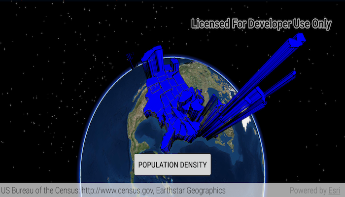

# Feature Layer Extrusion
Apply extrusion to a renderer on a feature layer.

## How to use the sample
Use the button at the bottom of the screen to toggle between extrusion by 'total population' and 'population density'.

## How it works
1. Create a `ServiceFeatureTable` from a web service and load all fields with `.queryFeaturesAsync(...)`.
1. Set the `ServiceFeatureTable` to a `FeatureLayer` and `.setFeatureRenderingMode(FeatureLayer.RenderingMode.DYNAMIC)`.
1. When defining the `FeatureLayer`'s `Renderer`, remember to `.setExtrusionMode(...)` on the `SceneProperties`.
1. Finally, also on `SceneProperties`, use `setExtrusionExpression("[SOME_FIELD]")` to a `Field` from the `ServiceFeatureTable`.

## Relevant API
* FeatureLayer
* ExtrusionMode
* Renderer
* SceneProperties

#### Tags
Visualization