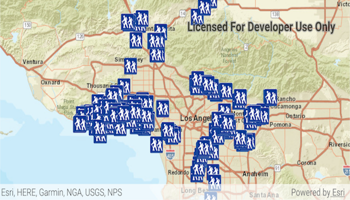

# Feature Layer (GeoDatabase)
Consume an Esri mobile geodatabase by using a `FeatureLayer` and a `GeodatabaseFeatureTable`.

## How to use the sample
Simply run the app and grant read permissions.

## How it works
The sample creates an instance of `GeodatabaseFeatureTable` by supplying a path to a local mobile geodatabase. The `FeatureLayer` is then supplied with the `GeodatabaseFeatureTable` and added to the Map. The mobile geodatabase can either be obtained through ArcMap, with the Create Runtime Content geoprocessing tool, or through a feature service with the `GeodatabaseSyncTask`.

## Relevant API
* FeatureLayer
* Geodatabase
* GeodatabaseFeatureTable

## Offline data
1. Download the data from [ArcGIS Online](https://www.arcgis.com/home/item.html?id=2b0f9e17105847809dfeb04e3cad69e0).
1. Extract the contents of the downloaded zip file to disk.
1. Open your command prompt and navigate to the folder where you extracted the contents of the data from step 1.
1. Execute the following command: `adb push LA_Trails.geodatabase /sdcard/ArcGIS/samples/FLGdb/LA_Trails.geodatabase`

Link | Local Location
---------|-------|
|[Los Angeles Trailheads](https://www.arcgis.com/home/item.html?id=2b0f9e17105847809dfeb04e3cad69e0)| `<sdcard>`/ArcGIS/samples/FLGdb/LA_Trails.geodatabase|

#### Tags
Layers