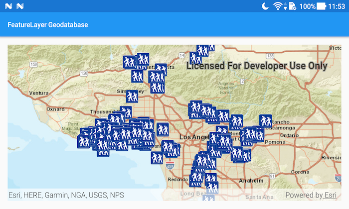

# Feature layer (GeoDatabase)
This sample demonstrates how to consume an Esri mobile geodatabase by using a `FeatureLayer` and a `GeodatabaseFeatureTable`.



## Features
- FeatureLayer
- Geodatabase
- GeodatabaseFeatureTable

## Developer Pattern
The sample creates an instance of `GeodatabaseFeatureTable` by supplying a path to a local mobile geodatabase. The `FeatureLayer` is then supplied with the `GeodatabaseFeatureTable` and added to the Map. The mobile geodatabase can either be obtained through ArcMap, with the Create Runtime Content geoprocessing tool, or through a feature service with the `GeodatabaseSyncTask`.

```java
// create a new geodatabase from local path
    final Geodatabase geodatabase = new Geodatabase(path);
    // load the geodatabase
    geodatabase.loadAsync();
    // add feature layer from geodatabase to the ArcGISMap
    geodatabase.addDoneLoadingListener(() -> {
      if (geodatabase.getLoadStatus() == LoadStatus.LOADED) {
        // access the geodatabase's feature table Trailheads
        GeodatabaseFeatureTable geodatabaseFeatureTable = geodatabase.getGeodatabaseFeatureTable("Trailheads");
        geodatabaseFeatureTable.loadAsync();
        // create a layer from the geodatabase feature table above and add to map
        final FeatureLayer featureLayer = new FeatureLayer(geodatabaseFeatureTable);
        featureLayer.addDoneLoadingListener(() -> {
          if (featureLayer.getLoadStatus() == LoadStatus.LOADED) {
            // set viewpoint to the location of feature layer's features
            mMapView.setViewpointAsync(new Viewpoint(featureLayer.getFullExtent()));
            
      ...
```

## Provision your device
1. Download the data from [ArcGIS Online](https://www.arcgis.com/home/item.html?id=2b0f9e17105847809dfeb04e3cad69e0).
1. Extract the contents of the downloaded zip file to disk.
1. Open your command prompt and navigate to the folder where you extracted the contents of the data from step 1.
1. Execute the following command: ```adb push LA_Trails.geodatabase /sdcard/ArcGIS/samples/FLGdb/LA_Trails.geodatabase```


Link | Local Location
---------|-------|
|[Los Angeles Trailheads](https://www.arcgis.com/home/item.html?id=2b0f9e17105847809dfeb04e3cad69e0)| `<sdcard>`/ArcGIS/samples/FLGdb/LA_Trails.geodatabase|
