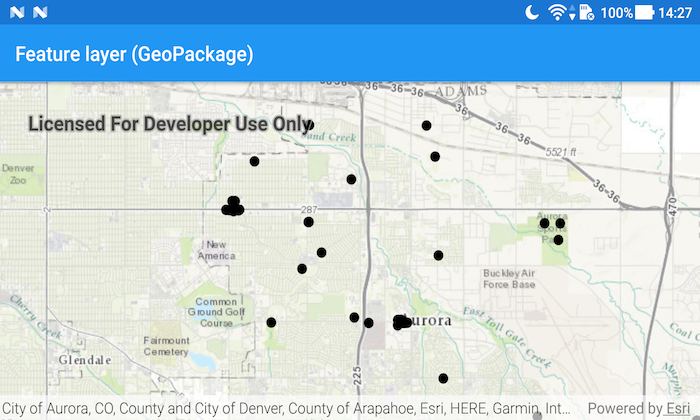

# Feature layer (GeoPackage)

Display features from a local GeoPackage.

## Use case

A GeoPackage is an OGC standard, making it useful when your project requires an open source data format or when other, non-ArcGIS systems may be creating the data. Accessing data from a local GeoPackage is useful when working in an environment that has an inconsistent internet connection or that does not have an internet connection at all. For example, a department of transportation field worker might source map data from a GeoPackage when conducting signage inspections in rural areas with poor network coverage.

## How to use the sample

Pan and zoom around the map. View the data loaded from the geopackage.

## How it works

1. Create a `GeoPackage` passing the URI string into the constructor.
2. Load the `GeoPackage` with `GeoPackage.loadAsync`
3. When it's done loading, get the `GeoPackageFeatureTable` objects from the geopackage with `geoPackage.getGeoPackageFeatureTables()`
4. Create a `FeatureLayer(featureTable)` for each feature table and add it to the map as an operational layer. Add each to 
   the map as an operational layer with `map.getOperationalLayers().add(featureLayer)`

## Relevant API

* ArcGISMap
* FeatureLayer
* GeoPackage
* GeoPackageFeatureTable

## Offline Data

1. Download the data from [ArcGIS Online](https://www.arcgis.com/home/item.html?id=68ec42517cdd439e81b036210483e8e7).
2. Extract the contents of the downloaded zip file to disk.
3. Open your command prompt and navigate to the folder where you extracted the contents of the data from step 1.
4. Push the data into the scoped storage of the sample app:
`adb push AuroraCO.gpkg /Android/data/com.esri.arcgisruntime.sample.featurelayergeopackage/files/AuroraCO.gpkg`

## About the data

The map shows point locations of public art installations in Aurora, Colorado.

## Tags

feature table, geopackage, gpkg, OGC, package, standards
