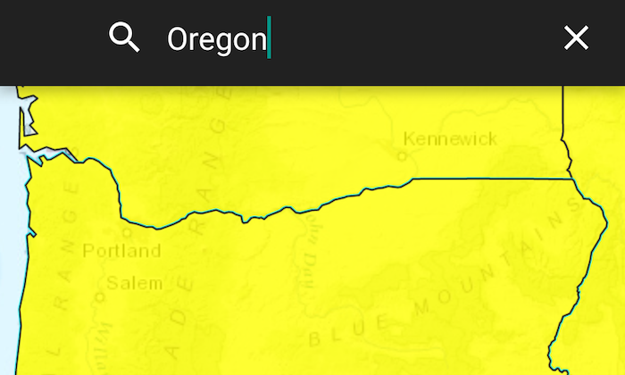

# Feature layer query

Find features in a feature table which match an SQL query.

## Use case

Query expressions can be used in ArcGIS to select a subset of features from a feature table. This is most useful in large or complicated data sets. A possible use case might be on a feature table marking the location of street furniture through a city. A user may wish to query by a TYPE column to return "benches". In this sample, we query a U.S. state by STATE_NAME from a feature table containing all U.S. states.

## How to use the sample

Input the name of a U.S. state into the text field. When you tap enter, a query is performed and the matching features are highlighted or an error is returned.

## How it works

1. Create a `ServiceFeatureTable` using the URL of a feature service.
2. Create a `QueryParameters` with a where clause specified using `setWhereClause()`.
3. Perform the query using `queryFeaturesAsync(query)` on the service feature table.
4. When complete, the query will return a `FeatureQueryResult` which can be iterated over to get the matching features.

## About the data

This sample uses U.S. State polygon features from the [USA 2016 Daytime Population](https://www.arcgis.com/home/item.html?id=f01f0eda766344e29f42031e7bfb7d04) feature service.

## Relevant API

* FeatureLayer
* FeatureQueryResult
* QueryParameters
* ServiceFeatureTable

## Tags

Search and Query
