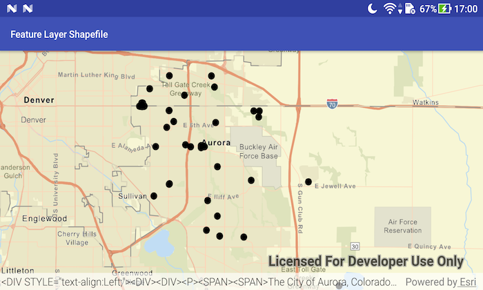

# Feature layer shapefile

Open a shapefile stored on the device and display it as a feature layer with default symbology.

## Use case

Shapefiles store location, shape and attributes of geospatial vector data. Shapefiles can be loaded directly into ArcGIS Runtime.

## How to use the sample

Pan and zoom around the map. View the data loaded from the shapefile.

## How it works

1. Create a `ShapefileFeatureTable` passing in the URL of a shapefile.
2. Create a `FeatureLayer` using the shapefile feature table.
3. Add the layer to the map's operational layers.

## Relevant API

* FeatureLayer
* ShapefileFeatureTable

## Offline Data

1. Download the data from [ArcGIS Online](https://www.arcgis.com/home/item.html?id=d98b3e5293834c5f852f13c569930caa).
2. Extract the contents of the downloaded zip file to disk.
3. Open your command prompt and navigate to the folder where you extracted the contents of the data from step 1.
4. Push the data into the scoped storage of the sample app:
`adb push Aurora_CO_shp /Android/data/com.esri.arcgisruntime.sample.featurelayershapefile/files/Aurora_CO_shp`

## Tags

Layers, shapefile, shp, vector
