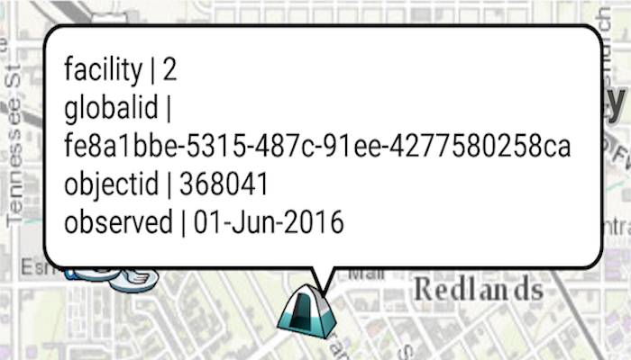

# Feature Layer Show Attributes

Return all loaded features from a query to show all attributes.

## Use case

Attributes can be used to help describe the objects represented by a feature.

## How to use the sample

Tap on a feature to see its attributes in a callout.

## How it works

1. Create an instance of a `ServiceFeatureTable`.
2. Query selected features with `serviceFeatureTable.queryFeaturesAsync(...)` and pass in the parameter `ServiceFeatureTable.QueryParameters.LOAD_ALL` to get all of the attributes for that feature.
3. Get the `FeatureQueryResult` and iterate through the results to display each attribute in a callout.

## Relevant API

* Feature
* FeatureLayer
* FeatureQueryResult
* ServiceFeatureTable

#### Tags

features, layers, query, attributes
