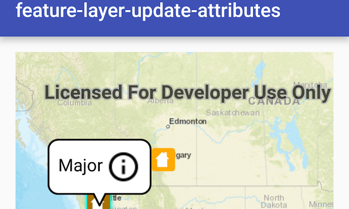

# Feature layer update attributes

Update feature attributes in an online feature service.    

## Use case

Online feature services can be updated with new data. This is useful for updating existing data in real time while working in the field.

## How to use the sample

Features in the map represent properties and are symbolized based on the type of damage to the property. Tapping on a feature displays the callout. The callout contains information about the type of damage on that property. In order to change the type of damage, tap on the info icon in the callout. Doing so displays a list of damage types values to choose from. Selecting one of the damage types will dismiss the list and update the feature with the new value.

## How it works

1. Create a `ServiceFeatureTable` object from a URL.
2. Create a `FeatureLayer` object from the `ServiceFeatureTable`.
3. Select features from the `FeatureLayer`.
4. To update the feature's attribute, first load it, then use `getAttributes().put(key, value)`.
5. Update the table with `updateFeatureAsync`.
6. After a change, apply the changes on the server using `applyEditsAsync`.

## Relevant API

* ArcGISFeature
* FeatureLayer
* ServiceFeatureTable

## Tags

amend, attribute, details, edit, editing, information, value
