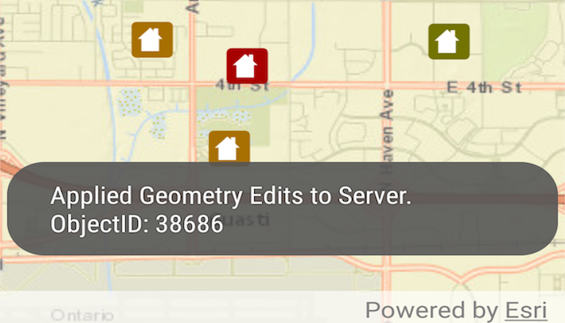

# Feature layer update geometry

Update a feature's location in an online feature service.

## Use case

Sometimes users may want to edit features in an online feature service by moving them.

## How to use the sample

Tap a feature to select it. Tap again to set the updated location for that feature. An alert will be shown confirming success or failure.

## How it works

1. Create a `ServiceFeatureTable` object from a URL.
2. Create a `FeatureLayer` object from the `ServiceFeatureTable`.
3. Identify layers from the feature layer to find features, and select a feature with `selectFeatures(identifiedFeature)`.
4. Change the selected feature's location using `identifiedFeature.setGeometry(...)`.
5. After the change, update the table on the server using `applyEditsAsync()`.

## Relevant API

* Feature
* FeatureLayer
* ServiceFeatureTable

## Tags

editing, feature layer, feature table, moving, service, updating