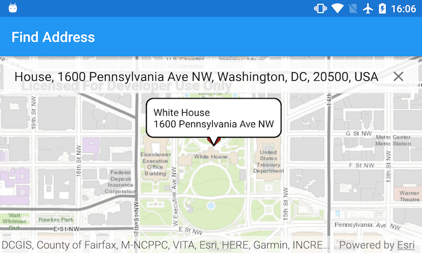

# Find address

Find the location for an address.

## Use case

A user can input a raw address into your app's search bar and zoom to the address location.

## How to use the sample

Type in an address in the search view at the top of the screen. Suggestions will appear as text is entered. Tap a suggestion or enter your own text to see the address marked with a pin. Tapping on the pin will show the address in a callout.

## How it works

1. Create a `LocatorTask` using the URL to a locator service.
2. Set the `GeocodeParameters` for the locator task and specify the geocode's attributes.
3. Get the matching results from the `GeocodeResult` using `locatorTask.geocodeAsync(addressString, geocodeParameters)`.
4. Create a `Graphic` with the geocode result's location and store the geocode result's attributes in the graphic's attributes.
5. Show the graphic in a `GraphicsOverlay`.

## Relevant API

* GeocodeParameters
* GeocodeResult
* LocatorTask

## Tags

address, geocode, locator, search