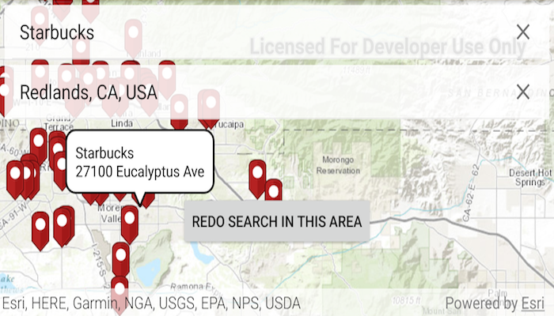

# Find Place
Use geocode functionality to search for points of interest, around a location or within an extent.

## How to use the sample
Specify the point of interest in the `POI` SearchView (e.g. Starbucks). For the proximity field you can choose between your current location, by leaving the SearchView blank, or any other location by entering text. Suggestions will appear while the user is typing. When a suggestion is selected, or the submit query button is tapped, the resulting locations are shown on the map. Tapping on a pin will show details about that location in a callout. A button at the bottom called 'Redo Search in this Area' will let you search by the current viewpoint's midpoint.

## How it works
The sample uses the `.suggestAsync(searchText, suggestParameters)` method on the `LocatorTask` to get suggestions while you are typing. The suggestions for each textfield are restricted using `.getCategories.add(" ")` on `SuggestParameters`.

If a proximity location is specified, the sample uses the `GeocodeResult.getDisplayLocation()` method to get the coordinates for that location. It then uses that location in the `GeocodeParameters.setSearchArea()` and finds the POIs using `LocatorTask.suggestAsync(poiTypedText, geocodeParameters)`, with the point of interest you entered as the text. 

When you tap on the `Redo Search in This Area` button, the same method is called, but this time the `GeocodeParameters.setSearchArea()` is set to `MapView.getCurrentViewpoint(...)`. 

## Relevant API
* GeocodeParameters
* GeocodeResult
* LocatorTask
* SuggestParameters
* SuggestResult

#### Tags
Search and Query