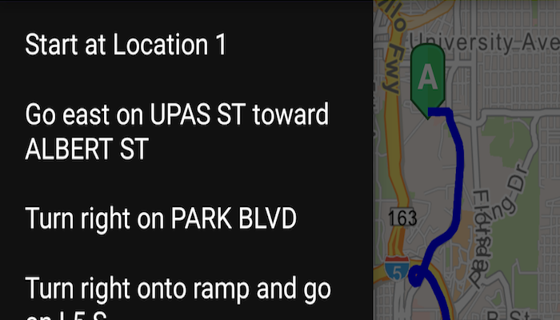

# Find Route
Get a route between two locations.

# How to use the sample
For simplicity the sample comes with Source and Destination stops. You can click on the Navigation  Floating Action Button to get a route between the stops. Once a route is generated, the `DrawerLayout` is unlocked and you can view the direction maneuver as a list.

# How it works
The sample creates a `RouteTask` from a URL and uses default `RouteParameters` from the `RouteTask` service to set up the 'stops'. In order to get detailed driving directions, `setReturnDirections` is set true in the parameters. `RouteTask.solveAsync` is used to solve for route. The `RouteResult` is then used to create the route graphics and `getDirectionManeuvers()` on route result returns step-by-step direction list which is populated in the `ListView`.

# Relevant API
* DirectionManeuver
* Route
* RouteParameters
* RouteResult
* RouteTask

#### Tags
Routing and Logistics
