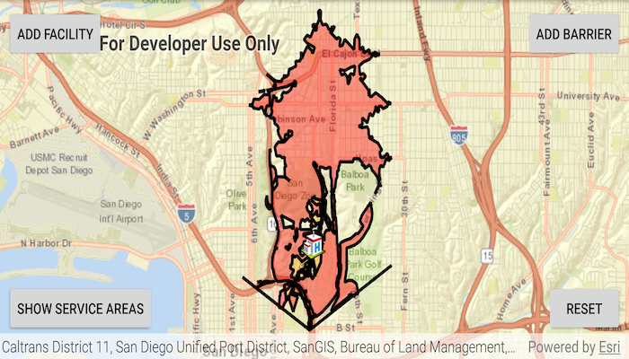

# Find service area

Find the service area within a network from a given point.

## Use case
A service area shows locations that can be reached from a facility based
off a certain impedance (such as travel time or distance). Barriers can
also be added which can effect the impedance by not letting traffic
through or adding the time is takes to pass that barrier.

Service areas might be used by a hospital to know the areas they can
reach in a set amount of time.

## How to use the sample
In order to find any service areas at least one facility needs to be
added to the map view.
1. To add a facility, click the facility button, then click anywhere on
   the map.
2. To add a barrier, click the barrier button, and click multiple
   locations on map.
3. Hit the barrier button again to finish drawing barrier. Hitting any
   other button will also stop the barrier from drawing.
4. To show service areas around facilities that were added, click show
   service areas button. 
   
The reset button, clears all graphics and reset ServiceAreaTask.
   
## How it works

1. Create a new `ServiceAreaTask` from an online service.
2. Create default `ServiceAreaParameters` from the service area task.
3. Set the parameters to return polygons (true) to return all service
   areas.
4. Add a `ServiceAreaFacility` to the parameters.
5. Get the `ServiceAreaResult` by solving the service area task using
   the parameters.
6. Get any `ServiceAreaPolygons` that were returned,
   serviceAreaResult.getResultPolygons(facilityIndex). 
7. Display the service area polygons as graphics in a `GraphicsOverlay`
   on the `MapView`.

## Relevant API

* PolylineBarrier
* ServiceAreaFacility
* ServiceAreaParameters
* ServiceAreaPolygon
* ServiceAreaResult
* ServiceAreaTask

#### Tags
Routing and Logistics 
