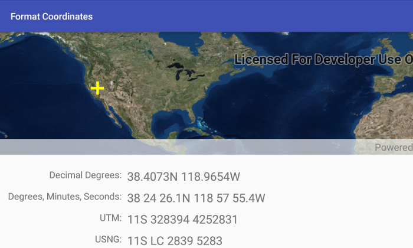

# Format Coordinates
Convert a map location `Point` in WGS 1984 spatial reference to a number of different coordinate notations (decimal degrees; degrees, minutes, seconds; Universal Transverse Mercator (UTM), and United States National Grid (USNG)), by using `CoordinateFormatter`.

## How to use the sample
* Tap on the map to see the formatted coordinates at the tapped location.
* Tap on a coordinate and enter a new coordinate string in the dialog; the graphic in the map, and also the other coordinates, will be updated from this new value.

Coordinates can be written and formatted in different ways, for example latitude, longitude coordinates can be formatted as decimal degrees, or degrees, minutes, and seconds.  Additionally, coodinate notation strings can be converted to a `Point` and shown in the map by tapping on the notation values shown and entering a coordinate in the appropriate notation. 

The `CoordinateFormatter` also supports Military Grid Reference System (MGRS), Global Area Reference System (GARS), and World Geographic Reference System (GEOREF) notations, using similar methods to those shown in this sample app.

## How it works 
An inital default map location is shown in the `MapView` as a `Graphic`. The `CoordinateFormatter` methods `toLatitudeLongitude`, `toUtm`, and `toUSNG` are used to convert the `Point` representing the tapped map location to different coordinate notation formats. Note that the `toLatitudeLongitude` method can be used to format the coordinates in different ways, by passing in different `LatitudeLongitudeFormat` values.

## Relevant API
* CoordinateFormatter
* Point
* Graphic
* DefaultMapViewOnTouchListener

#### Tags
Edit and Manage Data
