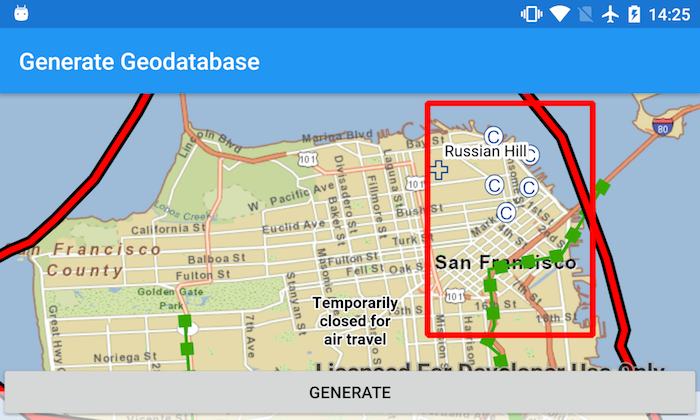

# Generate geodatabase

Generate a local geodatabase from an online feature service.



## Use case

Generating geodatabases is the first step toward taking a feature service offline. It allows you to save features locally for offline display.

## How to use the sample

Zoom to any extent. Then tap the generate button to generate a geodatabase of features from a feature service filtered to the current extent. A red outline will show the extent used. The job's progress is shown while the geodatabase is generated. When complete, the map will reload with only the layers in the geodatabase, clipped to the extent.

## How it works

1. Create a `GeodatabaseSyncTask` with the URL of the feature service and load it.
2. Create `GenerateGeodatabaseParameters` specifying the extent and whether to include attachments.
3. Create a `GenerateGeodatabaseJob` with `geodatabaseSyncTask.generateGeodatabaseAsync(parameters, downloadPath)`. Start the job with `job.start()`.
4. When the job is done, `job.getResult()` will return the geodatabase. Inside the geodatabase are feature tables which can be used to add feature layers to the map.
5. Call `syncTask.unregisterGeodatabaseAsync(geodatabase)` after generation when you're not planning on syncing changes to the service.

## Relevant API

* GenerateGeodatabaseJob
* GenerateGeodatabaseParameters
* Geodatabase
* GeodatabaseSyncTask

## Offline data
1. Download the data from [ArcGIS Online](https://arcgisruntime.maps.arcgis.com/home/item.html?id=72e703cd01654e7796eb1ae75af1cb53).  
2. Extract the contents of the downloaded zip file to disk.  
3. Create an ArcGIS/samples/MapPackage folder on your device. You can use the [Android Debug Bridge (adb)](https://developer.android.com/guide/developing/tools/adb.html) tool found in **<sdk-dir>/platform-tools**.
4. Open up a command prompt and execute the ```adb shell``` command to start a remote shell on your target device.
5. Navigate to your sdcard directory, e.g. ```cd /sdcard/```.  
6. Create the ArcGIS/samples/TileCache directory, ```mkdir ArcGIS/samples/TileCache```.
7. You should now have the following directory on your target device, ```/sdcard/ArcGIS/samples/TileCache```. We will copy the contents of the downloaded data into this directory. Note:  Directory may be slightly different on your device.
8. Exit the shell with the, ```exit``` command.
9. While still in your command prompt, navigate to the folder where you extracted the contents of the data from step 1 and execute the following command: 
	* ```adb push SanFrancisco.tpk /sdcard/ArcGIS/samples/TileCache```


Link | Local Location
---------|-------|
|[San Francisco Tile Cache](https://arcgisruntime.maps.arcgis.com/home/item.html?id=72e703cd01654e7796eb1ae75af1cb53)| `<sdcard>`/ArcGIS/samples/TileCache/SanFrancisco.tpk |

## Tags

disconnected, local geodatabase, offline, sync