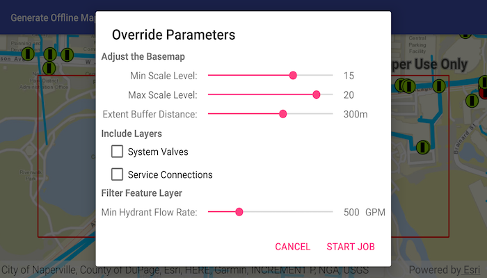

# Generate offline map (overrides)

Take a web map offline with additional options for each layer.

## Use case

When taking a web map offline, you may adjust the data (such as layers or tiles) that is downloaded by using custom parameter overrides. This can be used to reduce the extent of the map or the download size of the offline map. It can also be used to highlight specific data by removing irrelevant data. Additionally, this workflow allows you to take features offline that don't have a geometry - for example, features whose attributes have been populated in the office, but still need a site survey for their geometry.

## How to use the sample

Sign in with an ArcGIS Online organizational account when prompted for credentials (taking web maps offline requires an account) and modify the overrides parameters:

* Use the min/max scale input fields to adjust the level IDs to be taken offline for the streets basemap.
* Use the extent buffer distance input field to set the buffer radius for the streets basemap.
* Check the checkboxes for the feature operational layers you want to include in the offline map.
* Use the min hydrant flow rate input field to only download features with a flow rate higher than this value.
* Select the "Water Pipes" checkbox if you want to crop the water pipe features to the extent of the map.

After you have set up the overrides to your liking, tap the "Generate offline map" button to start the download. A progress bar will display. Tap the "Cancel" button if you want to stop the download. When the download is complete, the view will display the offline map. Pan around to see that it is cropped to the download area's extent.

## How it works

1. Load a web map from a `PortalItem`.
2. Create an `OfflineMapTask` with the map.
3. Generate default task parameters using the extent area you want to download with `offlineMapTask.createDefaultGenerateOfflineMapParametersAsync(extent)`.
4. Generate additional "override" parameters using the default parameters with `offlineMapTask.createGenerateOfflineMapParameterOverridesAsync(parameters)`.
5. For the basemap:
    * Get the parameters `OfflineMapParametersKey` for the basemap layer.
    * Get the `ExportTileCacheParameters` for the basemap layer with `overrides.getExportTileCacheParameters().get(basemapParamKey)`.
    * Set the level IDs you want to download with `exportTileCacheParameters.getLevelIDs().add(levelID)`.
    * To buffer the extent, use `exportTileCacheParameters.setAreaOfInterest(bufferedGeometry)` where bufferedGeometry can be calculated with the `GeometryEngine`.
6. To remove operational layers from the download:
    * Create a `OfflineParametersKey` with the operational layer.
    * Get the generate geodatabase layer options using the key with `List<GenerateLayerOption> layerOptions = overrides.getGenerateGeodatabaseParameters().get(key).getLayerOptions()`
    * Loop through each `GenerateLayerOption` in the the list, and remove it if the layer option's ID matches the layer's ID.
7. To filter the features downloaded in an operational layer:
    * Get the layer options for the operational layer using the directions in step 6.
    * Loop through the layer options. If the option layerID matches the layer's ID, set the filter clause with `layerOption.setWhereClause(sqlQueryString)` and set the query option with `layerOption.setQueryOption(GenerateLayerOption.QueryOption.USE_FILTER)`.
8. To not crop a layer's features to the extent of the offline map (default is true):
    * Set `layerOption.setUseGeometry(false)`.
9. Create a `GenerateOfflineMapJob` with `offlineMapTask.generateOfflineMap(parameters, downloadPath, overrides)`. Start the job with `job.start()`.
10. When the job is done, get a reference to the offline map with `job.getResult.getOfflineMap()`

## Relevant API

* ExportTileCacheParameters
* GenerateGeodatabaseParameters
* GenerateLayerOption
* GenerateOfflineMapJob
* GenerateOfflineMapParameterOverrides
* GenerateOfflineMapParameters
* GenerateOfflineMapResult
* OfflineMapParametersKey
* OfflineMapTask

## Additional information

For applications where you just need to take all layers offline, use the standard workflow (using only `GenerateOfflineMapParameters`). For a simple example of how you take a map offline, please consult the "Generate offline map" sample.

## Tags

adjust, download, extent, filter, LOD, offline, override, parameters, reduce, scale range, setting
