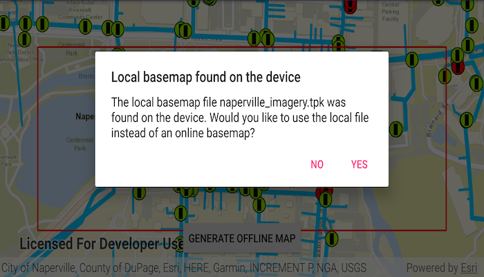

# Generate offline map with local basemap

Use the offline map task to take a web map offline, but instead of downloading an online basemap, use one which is already on the device.

## Use case

There are a number of use-cases where you may wish to use a basemap which is already on the device, rather than downloading:

* You want to limit the total download size.
* You want to be able to share a single set of basemap files between many offline maps.
* You want to use a custom basemap (for example authored in ArcGIS Pro) which is not available online.
* You do not wish to sign into ArcGIS.com in order to download Esri basemaps.

The author of a web map can support the use of basemaps which are already on a device by configuring the web map to specify the name of a suitable basemap file. This could be a basemap which:

* Has been authored in ArcGIS Pro to make use of your organizations custom data.
* Is available as a PortalItem which can be downloaded once and re-used many times.

## How to use the sample

Tap on "Generate Offline Map". You will be prompted to choose whether you wish to download the online basemap or use the "naperville_imagery.tpk" basemap (see Offline Data section). If you choose to download the online basemap, the offline map will be generated with the same (topographic) basemap as the online web map. To download the Esri basemap, you may be prompted to sign in to ArcGIS.com. 

If you choose to use the basemap from the device, the offline map will be generated with the local imagery basemap. The download will be quicker since no tiles are exported or downloaded. Since the application is not exporting online ArcGIS Online basemaps you will not need to log-in.

## How it works

1. Create a `PortalItem` object using a web map's ID and create an `ArcGISMap` from it. 
2. Initialize an `OfflineMapTask` object using the map. 
3. Request the default parameters for the task with `OfflineMapTask.createDefaultGenerateOfflineMapParametersAsync()`.
4. A `GenerateOfflineMapJob` is created by calling `OfflineMapTask.generateOfflineMap`.  
    * If desired, set the `GenerateOfflineMapParameters.referenceBasemapDirectory` to the absolute path of the directory which contains the .tpk file.
    * Otherwise a basemap will be downloaded.
5. Run the `GenerateOfflineMapJob` with basemap settings from step 4.

## Relevant API

* GenerateOfflineMapJob
* GenerateOfflineMapParameters
* GenerateOfflineMapResult
* OfflineMapTask

## Offline Data
1. Download the data from [ArcGIS Online](https://arcgisruntime.maps.arcgis.com/home/item.html?id=628e8e3521cf45e9a28a12fe10c02c4d).
1. Extract the contents of the downloaded zip file to disk.
1. Open your command prompt and navigate to the folder where you extracted the contents of the data from step 1.
1. Execute the following command:
`adb push naperville_imagery.tpk /sdcard/ArcGIS/Samples/TileCache/naperville_imagery.tpk`

Link | Local Location
---------|-------|
|[Naperville Imagery](https://arcgisruntime.maps.arcgis.com/home/item.html?id=628e8e3521cf45e9a28a12fe10c02c4d)| `<sdcard>`/ArcGIS/Samples/TileCache/naperville_imagery.tpk|

## Tags

basemap, download, local, offline, save, web map
