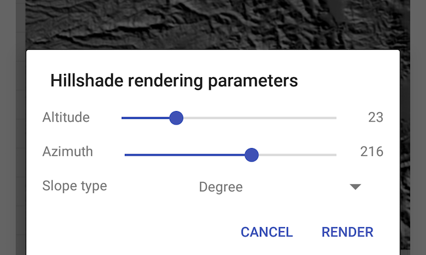

# Hillshade renderer

Apply a hillshade renderer to a raster.

## Use case

An environmental agency may track coastal erosion by comparing images of an area taken over a longer period of time with hillshade renderers applied.

## How to use the sample

Choose and adjust the settings to update the hillshade renderer on the raster layer. The sample allows you to change the Altitude, Azimuth, and Slope Type with controls found by tapping the wrench icon at top right.

## How it works

1. Create a `Raster` from a grayscale raster file.
2. Create a `RasterLayer` from the raster.
3. Create a `Basemap` from the raster layer and set it to the map.
4. Create a `HillshadeRenderer`, specifying the slope type and other properties.
5. Set the hillshade renderer to be used on the raster layer with `rasterLayer.setRenderer(renderer)`.

## Relevant API

* BasemapStyle
* HillshadeRenderer
* Raster
* RasterLayer

## Offline Data

1. Download the data from [ArcGIS Online](https://arcgisruntime.maps.arcgis.com/home/item.html?id=134d60f50e184e8fa56365f44e5ce3fb).
2. Extract the contents of the downloaded zip file to disk.
3. Open your command prompt and navigate to the folder where you extracted the contents of the data from step 1.
4. Push the data into the scoped storage of the sample app:
`adb push srtm-hillshade /Android/data/com.esri.arcgisruntime.sample.hillshaderenderer/files/srtm-hillshade`

## Tags

altitude, angle, azimuth, raster, slope, visualization
