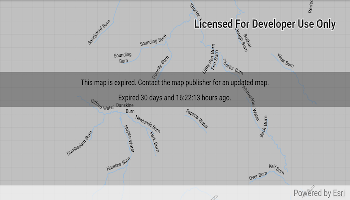

# Honor mobile map package expiration date

Access the expiration information of an expired mobile map package.

## Use case

The data contained within a mobile map package (MMPK) may only be relevant for a fixed period of time. Using ArcGIS Pro, the author of an MMPK can set an expiration date to ensure the user is aware the data is out of date.

As long as the author of an MMPK has set an expiration date, the expiration date can be read even if the MMPK has not yet expired. For example, developers could also use this API to warn app users that an MMPK may be expiring soon.

## How to use the sample

Load the app. The author of the MMPK used in this sample chose to set the MMPK's map as still readable, even if it's expired. The app presents expiration information to the user.

## How it works

1. Create a `MobileMapPackage` passing in the path to the mobile map package's location on the device.
2. Load the mobile map package.
3. Present `Expiration` information to the user with:
  * Use `getMessage()` to get the expiration message set by the author of the MMPK.
  * Use `getDate()` to get the expiration date set by the author of the MMPK.

## Relevant API

* Expiration
* MobileMapPackage

## Offline data

1. Download the data from [ArcGIS Online](https://arcgisruntime.maps.arcgis.com/home/item.html?id=174150279af74a2ba6f8b87a567f480b).
2. Extract the contents of the downloaded zip file to disk.
3. Open your command prompt and navigate to the folder where you extracted the contents of the data from step 1.
4. Execute the following command:
`adb push LothianRiversAnno.mmpk /sdcard/ArcGIS/Samples/MapPackage/LothianRiversAnno.mmpk`

Link | Local Location
---------|-------|
|[Lothian Rivers Anno MMPK](https://arcgisruntime.maps.arcgis.com/home/item.html?id=174150279af74a2ba6f8b87a567f480b)| `<sdcard>`/ArcGIS/Samples/MapPackage/LothianRiversAnno.mmpk|

## Tags

expiration, mmpk