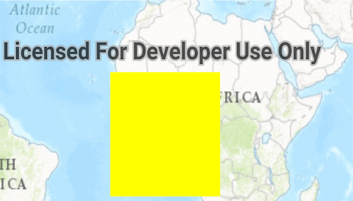

# Identify Graphics
Create a `Graphic` and add it to a `GraphicOverlay` where it can be identified from the `MapView`.

## How to use the sample
Tap on a graphic to identify it.

## How it works
### Graphics
Graphics represent graphic elements used in graphic overlays on the `MapView`. Graphics are contained in a modifiable `List` for graphics on a `GraphicsOverlay`.  The `ListenableList` interface defines a listenable `List` of graphics that can be notified when items are being added or removed from the `List`.

### Identify Graphics Overlay
You can identify on a graphics overlay from the `MapView.identifyOnGraphicsOverlay()` method which returns a `ListenableFuture<List<Graphic>>`.  Futures are an abstraction for asynchronous event driven systems that the Android platform provides.  The method returns immediately as a wrapper around the `List<Graphic>`, once the asynchronous event is completed you can access it with `ListenableFuture.get()`.

## Relevant API
* ArcGISMap
* DefaultMapViewOnTouchListener
* Graphic
* GraphicsOverlay
* MapView

#### Tags
Search and Query