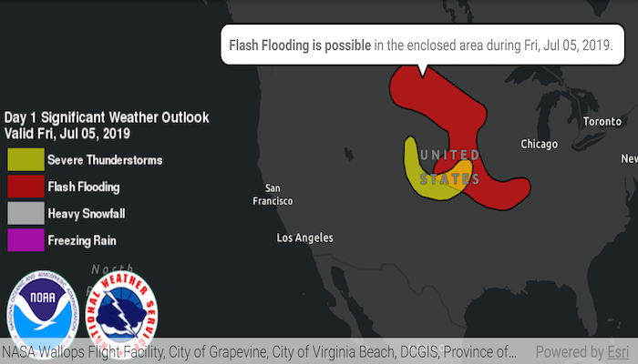

# Identify KML features

Show a callout with formatted content for a KML feature.

## Use case

A user may wish to select a KML feature to view relevant information about it.

## How to use the sample

Tap a feature to identify it. Feature information will be displayed in a callout.

Note: the KML layer used in this sample contains a screen overlay. The screen overlay contains a legend and the logos for NOAA and the NWS. You can't identify the screen overlay.

## How it works

1. Create an `OnTouchListener` on the `MapView`.
2. On tap:
  * Dismiss the `Callout`, if one is showing.
  * Call `MapView.identifyLayerAsync(...)` passing in the `KmlLayer`, screen point and tolerance.
  * Await the result of the identify and then get the `KmlPlacemark` from the result.
  * Create a callout at the calculated map point and populate the callout content with text from the placemark's `BalloonContent`. NOTE: KML supports defining HTML for balloon content and may need to be converted from HTML to text.
  * Show the callout.
  
Note: There are several types of KML features. This sample only identifies features of type `KmlPlacemark`.

## Relevant API

* GeoView.identifyLayerAsync
* IdentifyLayerResult
* KmlLayer
* KmlPlacemark

## About the data

This sample shows a forecast for significant weather within the U.S. Regions of severe thunderstorms, flooding, snowfall, and freezing rain are shown. Tap the features to see details.

## Additional information

KML features can have rich HTML content, including images.

## Tags

Keyhole, KML, KMZ, NOAA, NWS, OGC, weather