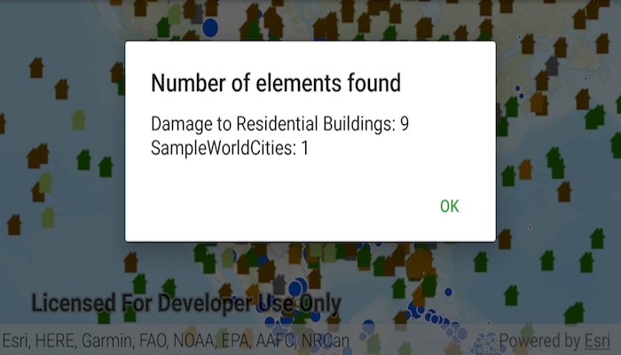

# Identify layers

Identify features in all layers in a map. 

## Use case

IdentifyLayers allows users to tap on a map, returning features at that location across multiple layers. Because some layer types have sublayers, the sample recursively counts results for sublayers within each layer.

## How to use the sample

Tap to identify features. An alert will show all layers with features under the tapped location, as well as the number of features.

## How it works

1. The tapped position is passed to `MapView.identifyLayersAsync`
2. For each `IdentifyLayerResult` in the results, features are counted. 
    * Note: there is one identify result per layer with matching features; if the feature count is 0, that means a sublayer contains the matching features.

## Relevant API

* IdentifyLayerResult
* IdentifyLayerResult.getSublayerResults
* MapView.identifyLayersAsync

## Additional information

The GeoView supports two methods of identify: `identifyLayerAsync()`, which identifies features within a specific layer and `identifyLayersAsync()`, which identifies features for all layers in the current view.

## Tags

identify, recursion, recursive, sublayers