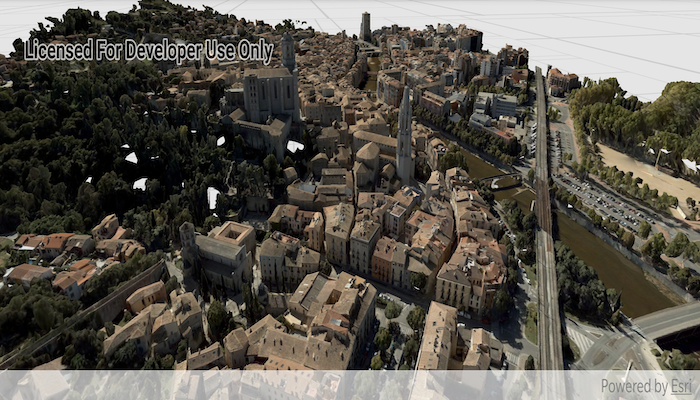

# Add an integrated mesh layer

View an integrated mesh layer from a scene service.

## Use case

An integrated mesh is used to generate a mesh over a point cloud data set, which may be derived from a detailed LiDAR survey. LiDAR data is often of a high enough resolution to capture 3D features as small as walls and trees, but also the irregular surfaces of geological features like cliffs. An integrated mesh made from a point cloud of LiDAR data will include realistic textures and elevation information.

## How it works

1. Create a scene.
2. Create an `IntegratedMeshLayer` with the URL to an integrated mesh layer 
scene service.
3. Add the layer to the scene's operational layers collection.
4. Create a `Camera` and set the `SceneView` object's viewpoint.

## Relevant API

* IntegratedMeshLayer

#### Tags
Layers
3D
integrated mesh
