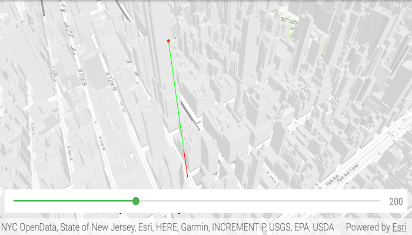

# Line of Sight GeoElement
Show a line of sight between two moving objects.

## Use Case
To determine if an observer can see a target, you can show a line of sight between them. The line will be green until it is obstructed, in which case it will turn red. By using the GeoElement variant of the line of sight, the line will automatically update when either GeoElement moves.

## How to use the sample

A line of sight will display between a point on the Empire State Building (observer) and a taxi (target). The taxi will drive around a block and the line of sight should automatically update. The taxi will be highlighted when it is visibile. You can change the observer height with the slider to see how it affects the target's visibility.

## How it works

To show a line of sight between two graphics:

1. Create an `AnalysisOverlay` and add it to the `SceneView` object's analysis overlays collection.
1. Create a `GeoElementLineOfSight`, passing in observer and target `GeoElement` objects (feautures or graphics). Add the line of sight to the analysis overlay's analyses collection.
1. To get the target visibility when it changes, add a `TargetVisibilityChangedListener` to the line of sight. The changed event will give the `TargetVisibility`.

## Relevant API

* AnalysisOverlay
* GeoElementLineOfSight
* LineOfSight.TargetVisibility

#### Tags
Analysis
