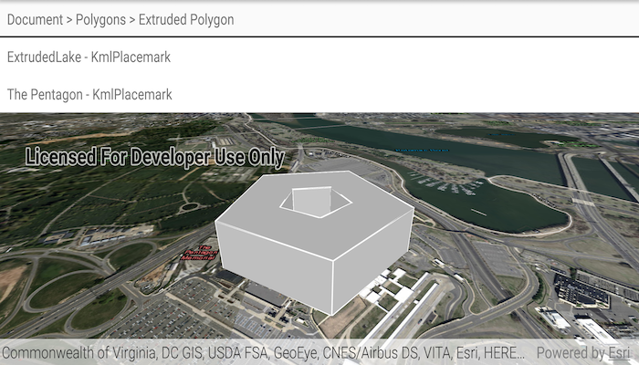

# List KML contents

List the contents of a KML file.

## Use case

KML files can contain a hierarchy of features, including network links to other KML content. A user may wish to traverse through the contents of KML nodes to know what data is contained within each node and, recursively, their children.

## How to use the sample

The contents of the KML file are shown in a tree. Select a node to zoom to that node. Not all nodes can be zoomed to (e.g. screen overlays).

## How it works

1. Create a `KmlLayer` from the `KmlDataset` which represents the KML file.
1. Add the KML layer to the `SceneView`'s operational layers.
2. Recursively explore each node of the `KmlDataSet` starting from the root nodes.
  * Each node is enabled for display at this step. KML files may include nodes that are turned off by default.
3. When a node is selected, use the node's `Extent` to determine a viewpoint and set the `SceneView` object's viewpoint to it.

## Relevant API

* KmlContainer
* KmlDataset
* KmlDocument
* KmlFolder
* KmlGroundOverlay
* KmlLayer
* KmlNetworkLink
* KmlNode
* KmlPlacemark
* KmlScreenOverlay

## Offline Data
1. Download the data from [ArcGIS Online](https://arcgisruntime.maps.arcgis.com/home/item.html?id=da301cb122874d5497f8a8f6c81eb36e).
2. Open your command prompt and navigate to the folder where you extracted the contents of the data from step 1.
3. Execute the following command:
`adb push esri_test_data.kmz /sdcard/ArcGIS/Samples/KML/esri_test_data.kmz`

Link | Local Location
---------|-------|
|[Esri Test Data KMZ](https://arcgisruntime.maps.arcgis.com/home/item.html?id=da301cb122874d5497f8a8f6c81eb36e)| `<sdcard>`/ArcGIS/Samples/KML/esri_test_data.kmz|

## Tags

Keyhole, KML, KMZ, layers, OGC