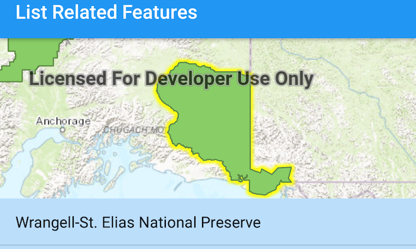

# List related features

List features related to the selected feature.

## Use case

Related features are useful for managing relational information, like what you would store in a relational database management system (RDBMS). You can define relationship between records as one-to-one, one-to-many, or many-to-one. For example, you could model inspections and facilities as a many-to-one relationship. Then, for any facility feature, you could list related inspection features.

## How to use the sample

Tap on a feature to select it. The related features will be displayed in a list.

## How it works

1. With a `Feature`, call `queryRelatedFeaturesAsync` on the feature's feature table.
2. Iterate over the result's collection of `RelatedFeatureQueryResult` objects to get the related features and add them to a list.

## Relevant API

* ArcGISFeature
* ArcGISFeatureTable
* ArcGISFeatureTable.queryRelatedFeatures
* FeatureQueryResult
* RelatedFeatureQueryResult

## Tags

features, identify, query, related, relationship, search
