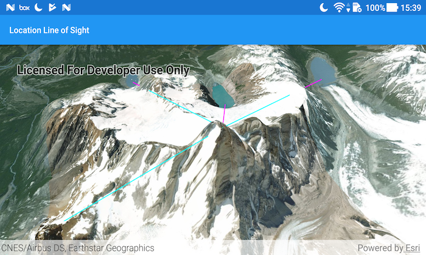

# Location line of sight

Perform a line of sight analysis between two points in real time.

## Use case

A line of sight analysis can be used to assess whether a view is obstructed between an observer and a target. Obstructing features could either be natural, like topography, or man-made, like buildings. Consider an events planning company wanting to commemorate a national event by lighting sequential beacons across hill summits or roof tops. To guarantee a successful event, ensuring an unobstructed line of sight between neighboring beacons would allow each beacon to be activated as intended.

## How to use the sample

Tap to turn on the touch event listener and lock in the observer location. Tap again to create a new target location. A magenta segment on the line means the view between observer and target is obstructed, whereas cyan means the view is unobstructed. 

## How it works

1. Create an `AnalysisOverlay` and add it to the scene view.
2. Make a `DefaultSceneViewOnTouchListener` to capture single taps.
3. For each target created, create a `LocationLineOfSight` between the observer and target locations and add it to the analysis overlay.

## Relevant API

* AnalysisOverlay
* LocationLineOfSight
* SceneView

## Tags

3D, line of sight, visibility, visibility analysis