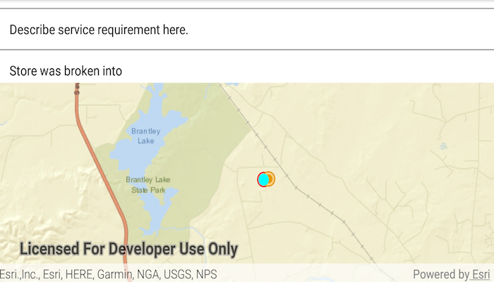

# Map image layer tables

Find features in a spatial table related to features in a non-spatial table.

## Use case

The non-spatial tables contained by a map service may contain additional information about sublayer features. Such information can be accessed by traversing table relationships defined in the service.

## How to use the sample

Once the map image layer loads, a list view will be populated with comment data from non-spatial features. Tap on one of the comments to query related spatial features and display the first result on the map.

## How it works

1. Create an `ArcGISMapImageLayer` with the URL of a map image service.
2. Load the layer and get one of its tables with `imageLayer.getTables().get(index)`.
3. To query the table, create a `QueryParameters` object. You can use `queryParameters.setWhereClause(sqlQueryString)` to filter the requested features.
4. Use `table.queryFeaturesAsync(parameters)` to get a `FeatureQueryResult` object.
5. The `FeatureQueryResult` is an iterable, so simply loop through it to get each result `Feature`.
6. To query for related features, get the table's relationship info with `table.getLayerInfo().getRelationshipInfos()`. This returns a list of `RelationshipInfo` objects. Choose which one to base your query on.
7. Now create `RelatedQueryParameters` passing in the `RelationshipInfo`. To query related features, use `table.queryRelatedFeaturesAsync(feature, relatedQueryParameters)`.
8. This returns a list of `RelatedFeatureQueryResult` objects, each containing a set of related features.

## Relevant API

* ArcGISFeature
* ArcGISMapImageLayer
* Feature
* FeatureQueryResult
* QueryParameters
* RelatedFeatureQueryResult
* RelatedQueryParameters
* RelationshipInfo
* ServiceFeatureTable

## Additional information

You can use `arcGISMapImageLayer.loadTablesAndLayersAsync()` to recursively load all sublayers and tables associated with a map image layer.

## Tags

features, query, related features, search