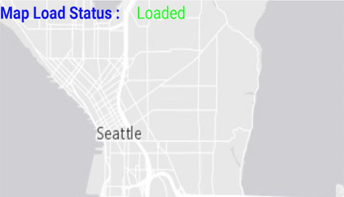

# Map load status

Determine the map's load status which can be: `NOT_LOADED`, `FAILED_TO_LOAD`, `LOADING`, `LOADED`.

## How to use the sample

Tap on the refresh button in the top right of the screen to reload the ArcGISMap. The load status of the ArcGISMap will be displayed on screen.

## How it works

1. Create an `ArcGISMap` and add it to a `MapView`.
2. Use `ArcGISMap.addLoadStatusChangedListener()` or `ArcGISMap.getNewLoadStatus()` to query the map's load status.

The `LoadStatus` is `LOADED` when any of the following criteria are met:

* The map has a valid spatial reference.
* The map has an an initial viewpoint.
* One of the map's predefined layers has been created.

## Relevant API

* ArcGISMap
* LoadStatusChangedListener
* MapView

## Tags

map
