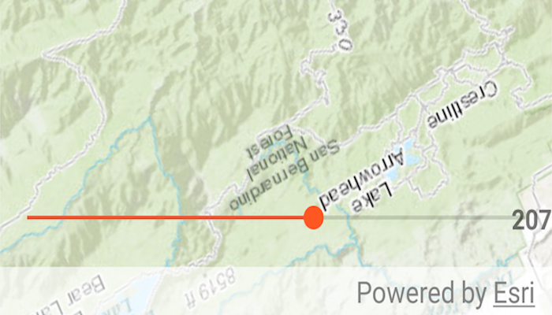

# Map Rotation
Rotate a map on your Android device using an Android `SeekBar`.

## How to use the sample
Slide the `SeekBar` at the bottom of the screen to apply a rotation to the `MapView`

## How it works
1. Create an Android `SeekBar`.
1. On progress change, use `MapView.setViewpointRotationAsync(...)` to a value obtained from the `SeekBar`.

## Relevant API
* ArcGISMap
* Basemap
* MapView

#### Tags
MapViews, SceneViews and UI
