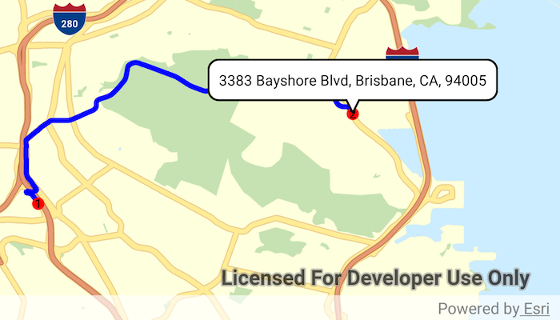

# Mobile map (search and route)

Display maps and use locators to enable search and routing offline using a Mobile Map Package.



## Use case

Mobile map packages make it easy to transmit and store the necessary components for an offline map experience including: transportation networks (for routing/navigation), locators (address search, forward and reverse geocoding), and maps. 

A field worker might download a mobile map package to support their operations while working offline.

## How to use the sample

A list of maps from a mobile map package will be displayed. If the map contains transportation networks, the list item will have a navigation icon. Tap on a map in the list to open it. If a locator task is available, tap on the map to reverse geocode the location's address. If transportation networks are available, a route will be calculated between geocode locations.

## How it works

1.  Create a `MobileMapPackage` using `MobileMapPackage(path).loadAsync()`.
2.  Get a list of maps inside the package using the `mobileMapPackage.getMaps()`.
3.  If the package has a locator, access it using `mobileMapPackage.getLocatorTask()`.
4.  To see if a map contains transportation networks, check `map.getTransportationNetworks()`.

## Relevant API

* GeocodeResult
* MobileMapPackage
* ReverseGeocodeParameters
* Route
* RouteParameters
* RouteResult
* RouteTask

## Offline data
1. Download the data from [ArcGIS Online](https://arcgisruntime.maps.arcgis.com/home/item.html?id=260eb6535c824209964cf281766ebe43).  
2. Extract the contents of the downloaded zip file to disk.  
3. Create an ArcGIS/samples/MapPackage folder on your device. You can use the [Android Debug Bridge (adb)](https://developer.android.com/guide/developing/tools/adb.html) tool found in **<sdk-dir>/platform-tools**.
4. Open up a command prompt and execute the ```adb shell``` command to start a remote shell on your target device.
5. Navigate to your sdcard directory, e.g. ```cd /sdcard/```.  
6. Create the ArcGIS/samples/MapPackage directory, ```mkdir ArcGIS/samples/MapPackage```.
7. You should now have the following directory on your target device, ```/sdcard/ArcGIS/samples/MapPackage```. We will copy the contents of the downloaded data into this directory. Note:  Directory may be slightly different on your device.
8. Exit the shell with the, ```exit``` command.
9. While still in your command prompt, navigate to the folder where you extracted the contents of the data from step 1 and execute the following command: 
	* ```adb push SanFrancisco.mmpk /sdcard/ArcGIS/samples/MapPackage```


Link | Local Location
---------|-------|
|[San Francisco Mobile Map Package](https://arcgisruntime.maps.arcgis.com/home/item.html?id=260eb6535c824209964cf281766ebe43)| `<sdcard>`/ArcGIS/samples/MapPackage/SanFrancisco.mmpk |

## Tags

disconnected, field mobility, geocode, network, network analysis, offline, routing, search, transportation