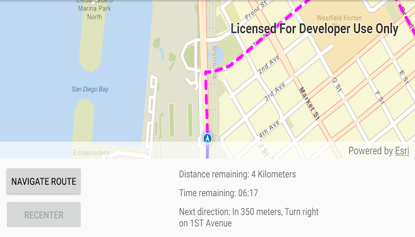

# Navigate route

Use a routing service to navigate between two points.

## Use case

Navigation is often used by field workers while traveling between two points to get live directions based on their location.

## How to use the sample

Tap 'Navigate Route' to simulate traveling and to receive directions from a preset starting point to a preset destination. Tap 'Navigate Route' again to start the simulation from the beginning.

## How it works

1. Create a `RouteTask` using a URL to an online route service.
2. Generate default `RouteParameters` using `routeTask.createDefaultParametersAsync()`.
3. Set `returnStops`, `returnDirections`, and `returnRoutes` on the parameters to true.
4. Add `Stop`s to the parameters' `stops` collection for each destination.
5. Solve the route using `routeTask.solveAsync(routeParameters)` to get a `RouteResult`.
6. Create a `RouteTracker` using the route result, and the index of the desired route to take.
7. Create a `RouteTrackerLocationDataSource` with the route tracker and simulated location data source to snap the location display to the route.
8. Create and register a `LocationChangedListener` with `MapView.LocationDisplay.addLocationChangedListener(locationChangedListener)`. Within the listener call `routeTracker.getTrackingStatus()` to display updated route information. Tracking status includes a variety of information on the route progress, such as the remaining distance, remaining geometry or traversed geometry (represented by a `Polyline`), or the remaining time (`Double`), amongst others.
9. Use `routeTracker.addNewVoiceGuidanceListener()` and get guidance using `newVoiceGuidanceEvent.getVoiceGuidance().getText()`. Use android's text-to-speech engine to provide spoken maneuver directions.
10. To establish whether the destination has been reached, use `trackingStatus.getDestinationStatus()`. If the destination status is `REACHED`, and the `remainingDestinationCount` is 1, we have arrived at the destination and can stop routing. If there are several destinations in your route, and the remaining destination count is greater than 1, switch the route tracker to the next destination.

## Relevant API

* DestinationStatus
* Location
* LocationDataSource
* ReroutingStrategy
* Route
* RouteParameters
* RouteTask
* RouteTracker
* Stop
* VoiceGuidance

## About the data

The route taken in this sample goes from the San Diego Convention Center, site of the annual Esri User Conference, to the Fleet Science Center, San Diego.

## Tags

directions, maneuver, navigation, route, turn-by-turn, voice
