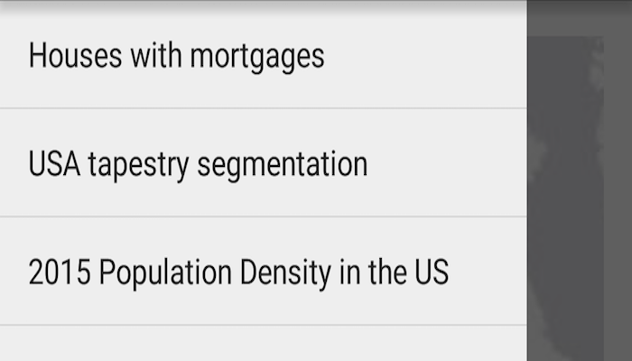

# Open existing map

Display a web map.

## Use case

For displaying web maps stored on ArcGISOnline (e.g. soil survey results, as demonstrated in this sample).

## How to use the sample

A web map can be selected from the navigation menu. On selection the web map displays in the map view.

## How it works

1. Create a `Portal`.
2. Create a `PortalItem` using the Portal and the web map ID: `new PortalItem(portal, ID)`.
3. Create a `ArcGISMap` using the portal item.
4. Set the map to the `MapView`.

## Relevant API

* ArcGISMap
* MapView
* Portal
* PortalItem

## Additional information

Mobile map packages can also include address locators and geometric networks. For an example of this, see the "Mobile Map Search and Route Sample".

## Tags

portal item, web map