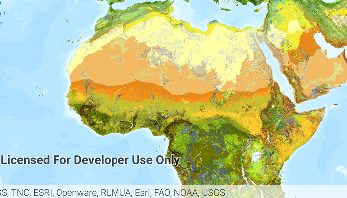

# Open Existing Map
### Category: Maps and Scenes


The Open Existing Map app demonstrates how to open an existing map as a `PortalItem` from a `Portal`. The app opens with a web map from a portal displayed.  You tap on the navigation drawer icon to see a list of pre-defined web maps.  Select any of the web maps to close the drawer and open it up in the `MapView`.

## Features

* ArcGISMap
* MapView
* Portal
* PortalItem

## Developer Pattern

`Portal` objects represent information from a portal such as ArcGIS Online.  `PortalItem` represents an item stored in a portal.  We create a `Map` from a `Portal` & `PortalItem` objects then pass the `Map` to the `MapView`.

```java
// get the portal url for ArcGIS Online
mPortal = new Portal(getResources().getString(R.string.portal_url));
// get the pre-defined portal id and portal url
mPortalItem = new PortalItem(mPortal, getResources().getString(R.string.webmap_houses_with_mortgages_id));
// create a map from a PortalItem
mMap = new Map(mPortalItem);
// set the map to be displayed in this view
mMapView.setMap(mMap);
```
