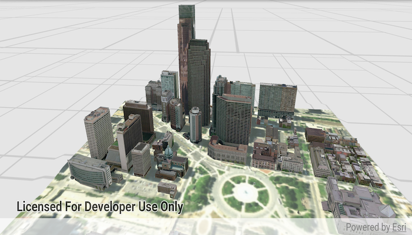

# Open mobile scene package

Opens and displays a scene from a Mobile Scene Package (.mspk).

## Use case

A mobile scene package is an archive containing the data (specifically, basemaps and features), used to display an offline 3D scene.

## How to use the sample

When the sample opens, it will automatically display the Scene in the Mobile Scene Package.

Since this sample works with a local .mspk, you will need to download the file to your device.

## How it works

1. Create a `MobileScenePackage` using the path to the local .mspk file.
2. Call `MobileScenePackage.loadAsync` and check for any errors.
3. When the `MobileScenePackage` is loaded, obtain the first `Scene` using `mobileScenePackage.getScenes().get(0)`
4. Create a `SceneView` and call `sceneView.setView` to display the scene from the package.

## Relevant API

* MobileScenePackage
* SceneView

## Offline data
1. Download the data from [ArcGIS Online](https://www.arcgis.com/home/item.html?id=7dd2f97bb007466ea939160d0de96a9d).
1. Extract the contents of the downloaded zip file to disk.
1. Open your command prompt and navigate to the folder where you extracted the contents of the data from step 1.
1. Execute the following command:
`adb push philadelphia.mspk /sdcard/ArcGIS/Samples/ScenePackage/philadelphia.mspk`

Link | Local Location
---------|-------|
|[Philadelphia mobile scene package](https://www.arcgis.com/home/item.html?id=7dd2f97bb007466ea939160d0de96a9d)| `<sdcard>`/ArcGIS/Samples/ScenePackage/philadelphia.mspk|

## Tags

offline, scene
