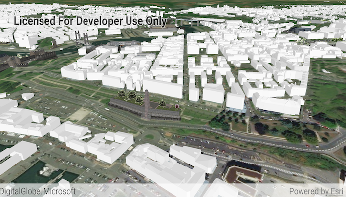

# Open scene (portal item)

Open a web scene from a portal item.

## Use case

A scene is symbolized geospatial content that allows you to visualize and analyze geographic information in an intuitive and interactive 3D environment. Web scenes are an ArcGIS format for storing scenes in ArcGIS Online or portal. Scenes can be used to visualize a complex 3D environment like a city.

## How to use the sample

When the sample opens, it will automatically display the scene from ArcGIS Online. Pan and zoom to explore the scene.

## How it works

To open a web scene from a portal item:

1. Create a `PortalItem` with an item ID pointing to a web scene.
2. Create an `ArcGISScene` passing in the portal item.
3. Set the scene by calling `SceneView.setScene(scene)` to display it.

## About the data

This sample uses a [Montreal, Canada Scene](https://www.arcgis.com/home/item.html?id=63a16e0c9f364d0fab9d55f40bf71771) hosted on ArcGIS Online.

## Relevant API

* ArcGISScene
* PortalItem
* SceneView

## Tags

portal, scene, web scene
