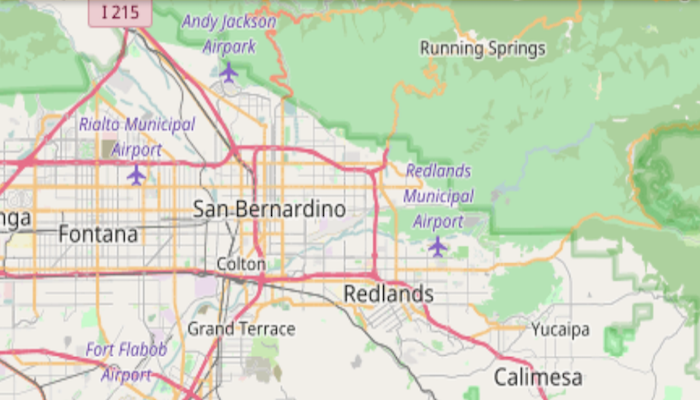

# OpenStreetMap layer

Add OpenStreetMap as a basemap layer.

## Use case

[OpenStreetMap](https://www.openstreetmap.org) is a free community-edited basemap.

## How to use the sample

When the sample opens, it will automatically display the map with the OpenStreetMap basemap. Pan and zoom to observe the basemap.

## How it works

1. Instantiate an `ArcGISMap` with a `BasemapStyle.OSM_STANDARD`
2. Show the map in a map view using `MapView.setMap(map)`.

## Relevant API

* Map
* MapView

## Additional information

The attribution text will be set to the required OpenStreetMap attribution automatically. 

Apps that expect to make many requests to OpenStreetMap should consider using an alternative tile server via the `WebTiledLayer` class.

Esri now hosts an [OpenStreetMap vector layer on ArcGIS Online](http://www.arcgis.com/home/item.html?id=3e1a00aeae81496587988075fe529f71) that uses recent OpenStreetMap data in conjunction with a style matching the default OpenStreetMap style. This layer is not subject to the tile access restrictions that apply to tiles fetched from OpenStreetMap.org.

## Tags

basemap, layers, map, open, OpenStreetMap, OSM, street
