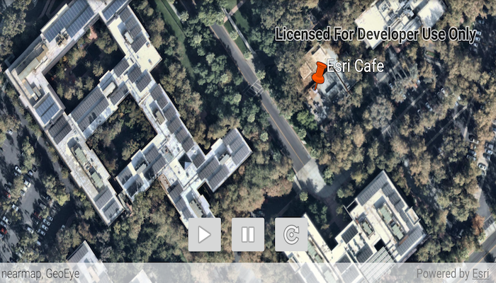

# Play a KML tour

Play tours in KML files.

## Use case

KML, the file format used by Google Earth, supports creating tours,
which can: control the viewpoint of the scene, hide and show content,
and play audio. Tours allow you to easily share tours of geographic
locations, which can be augmented with rich multimedia. Runtime allows
you to consume these tours using a simple API.

## How to use the sample

The sample will load a KMZ file. When a tour is found, the buttons will
be enabled. Use _Play_ and _Pause_ to control the tour. When you're
ready to show the tour, use _Reset_ to return the tour to the unplayed
state.

## How it works

1. Load the KML file and add it to a layer. 
2. Create the KML tour controller. Wire up the buttons to the `Play`,
   `Pause`, and `Reset` methods. 
1. Explore the tree of KML content and find
   the first KML tour. Once a tour is found, provide it to the KML tour
   controller. 
4. Enable the buttons to allow the user to play, pause, and reset the
   tour.
   
## Relevant API

* KmlTourController
* KmlTourController.Tour
* KmlTourController.Play()
* KmlTourController.Pause()
* KmlTourController.Reset()
* KmlTour 
* KmlTour.TourStatus 
* KmlTour.PropertyChanged

## Offline Data
1. Download the data from [ArcGIS Online](https://arcgisruntime.maps.arcgis.com/home/item.html?id=f10b1d37fdd645c9bc9b189fb546307c).
1. Extract the contents of the downloaded zip file to disk.
1. Open your command prompt and navigate to the folder where you extracted the contents of the data from step 1.
1. Execute the following command:
`adb push Esri_tour.kmz /sdcard/ArcGIS/Samples/KML/Esri_tour.kmz`

Link | Local Location
---------|-------|
|[Esri tour KMZ](https://arcgisruntime.maps.arcgis.com/home/item.html?id=f10b1d37fdd645c9bc9b189fb546307c)| `<sdcard>`/ArcGIS/Samples/KML/Esri_tour.kmz|

## About the data

This sample uses a custom tour created by a member of the ArcGIS Runtime
SDK samples team. When you play the tour, you'll see a narrated journey
through some of Esri's offices.

## Additional information

See
[Google's documentation](https://developers.google.com/kml/documentation/touring)
for information about authoring KML tours.

## Tags
Visualization 
KML
tour 
story 
interactive 
narration 
play 
pause 
animation
